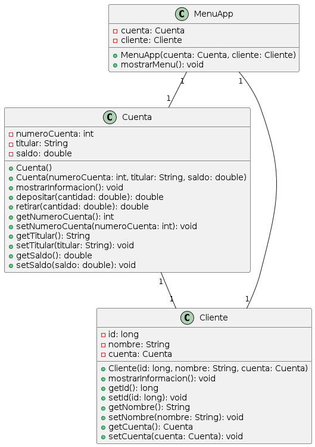

# Evaluación Integradora del Módulo 4 del Bootcamp Fullstack Java 

Al finalizar el Bootcamp Fullstack Java, se debe presentar un proyecto final, el cual consite en el desarrollo de una billetera digital **"Alke Wallet"**.

Como parte de ese proceso, el módulo 4 está enfocado en aprender **Java, JUnit, Eclipse, POO, SOLID**, lo cual se debe demostrar a través de la siguiente evaluación integradora.

## Requerimientos
### Requerimientos generales:
● Administración de fondos: Los usuarios deben poder ver su saldo disponible, realizar depósitos y retiros de fondos.
● Conversión de moneda: Los usuarios deben poder convertir fondos de una moneda a otra.

### Requerimientos técnicos/específicos:
● Java: implementando aplicación de consola que cumpla con los requisitos establecidos del paradigma orientado a objetos para
desarrollar y gestionar la lógica del negocio. Utilizar interfaces para reutilización de código.
● Diagramas de clase: Representar en un Diagrama de Clases el modelo de clases que da solución a los requerimientos.
● Pruebas unitarias: Se realizarán pruebas unitarias para garantizar la calidad y el correcto funcionamiento de los componentes desarrollados.

### Clases
class Cuenta {
    -numeroCuenta: int
    -titular: String
    -saldo: double

    +Cuenta()
    +Cuenta(numeroCuenta: int, titular: String, saldo: double)
    +mostrarInformacion(): void
    +depositar(cantidad: double): double
    +retirar(cantidad: double): double
    +getNumeroCuenta(): int
    +setNumeroCuenta(numeroCuenta: int): void
    +getTitular(): String
    +setTitular(titular: String): void
    +getSaldo(): double
    +setSaldo(saldo: double): void
}

class Cliente {
    -id: long
    -nombre: String
    -cuenta: Cuenta

    +Cliente(id: long, nombre: String, cuenta: Cuenta)
    +mostrarInformacion(): void
    +getId(): long
    +setId(id: long): void
    +getNombre(): String
    +setNombre(nombre: String): void
    +getCuenta(): Cuenta
    +setCuenta(cuenta: Cuenta): void
}

class MenuApp {
    -cuenta: Cuenta
    -cliente: Cliente

    +MenuApp(cuenta: Cuenta, cliente: Cliente)
    +mostrarMenu(): void
}

Cuenta "1" -- "1" Cliente
MenuApp "1" -- "1" Cuenta
MenuApp "1" -- "1" Cliente

### Diagrama de Clases

